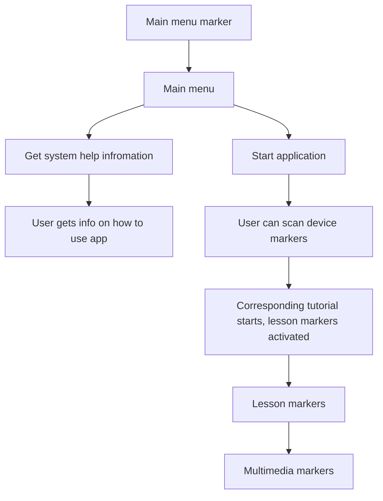

# 3 Literature review

## 3.1 Client-Server Architectures

## 3.2 Computer Vision (CV)

## 3.3 Augmented Reality (AR)

## 3.4 Prototypes Similar to Ours

 - bg ok, now prototypes

### (Pylvänäinen et al., 2023)

#### Goal & need for proto

 - Observation: there are no mobile apps for microscopy education that incorporate AR/VR features and step-bystep guidance (Pylvänäinen et al., 2023) 
 - They sent out a needs assessment survey to students and 70% of the respondents showed interest in using such an app in their microscopy studies. (Pylvänäinen et al., 2023)
 - App should:
   1. Teach microscopy
   2. Help to operate microscope
   3. Help with troubleshooting
   4. Be a tool to revive knowledge after a long pause (Pylvänäinen et al., 2023)

#### Technical details

 - App structure (Pylvänäinen et al., 2023):
   - Teach me microscopy (For independent studying)
   - Help me at the microscope
     - Virtual microscope
       - 3D model of an actual microscope (Leica DM RXA microscope)
       - Interactive step-by-step tutorials (usable while working on microscope)
         - microscopy parts
         - how to set optimal Köhler alignment
         - how to focus on the sample
     - Test your knowledge
     - Learn more
   - Help me to troubleshoot

 - "Help me at the microscope" also acts as an AR-environment (marker based); AR-markers help students find different parts of the microscope and their functions; (Pylvänäinen et al., 2023)
 - Support for microscope specific information through AR

#### Experiment results
 
 - the team then conducted a questionnaire based usability study and found that
 - students that used the app were more confident at using the microscope (Pylvänäinen et al., 2023)
 - statistics (Pylvänäinen et al., 2023):
   - app helped learning microscopy? 64% definitely; 36% somewhat
   - app helped recall microscopy skills? 90% definitely 10% somewhat

### (Estrada et al., 2022)

#### Goal & need for proto

 - Goal: Enable students to have a better experience when learning how to use electrical engineering lab equipment (Estrada et al., 2022)
 - How? Offer AR-based tutorials for various electrical engineering lab equipment. Use Deep Learning (DL) methods to detect such equipment in the laboratory. (Estrada et al., 2022)
 - Long term-goal: Develop interactive smartphone apps for different laboratory devices integrating this concept. (Estrada et al., 2022)

#### Technical details

 - What was built for this prototype (Estrada et al., 2022):
   - Superimposition based AR-app
   - DL-based component (DL-model integrated into AR-app)
   - Per-equipment
     - AR-UI
     - Step-by-step tutorials using AR-UI
   - Supported equipment (DL-based object detection):
     - multimeters
     - oscilloscopes
     - wave generators
     - power supplies
   - Supported equipment (object detection + step-by-step tutorials):
     - "real multimeters"

 - Application logic: How does this prototype work? (Estrada et al., 2022)
   1. DL-model detects (classifies & localizes) compatible equipment
   2. UI notifies user that app has tutorial available for detected equipment
   3. User decides to view tutorial
   4. AR-based tutorial is loaded
   5. 3D-object gets superimposed on top of real object, UI-panels (AR-UI) are used to display tutorial content

### (van Gestel et al, 2024)

#### Goal & need
 - Orthopedic procedures, use of power tools in surgery, guidance techniques & safety measures, new AR based real time safety solution (Van Gestel et al, 2024)
 - Existing AR-based and robotic surgery systems are often bulky (with a sizeable screen, camera and/or computer unit), expensive, and time-consuming, limiting their use in orthopedic surgery^13,14^." (Van Gestel et al, 2024)
 - HMDs exist, but can't do accurate enough tracking (millimeter scale) for surgical procedures (Van Gestel et al, 2024)

#### Technical details
 - solution developed on Microsoft HoloLens, using infrared sensor rather than RGB camera (tracking accuracy reasons) (Van Gestel et al, 2024)
 - infrared-reflective markers using the HoloLens’ on-board infrared sensor, (mean tracking error of 0.78 mm ± 0.74 mm; unpublished Vicon validation testing) (Van Gestel et al, 2024)
 - markers are not physical markers, rather markers registered by an infrared-tracked stylus at each of the 12 entry points (Van Gestel et al, 2024)
 - AR-guidance vector showed correct drilling direction. If drilling direction aligned with the one showed by guide vector guide vector was green, otherwise it was orange/red depending on how big the difference between the actual & desired drilling directions was (Van Gestel et al, 2024)

#### Experiment & results
- Developed tool tested by letting 18 people drill on wooden models & comparing the drilled output itself between AR & other guidance techniques (Van Gestel et al, 2024)
- three guidance techniques: freehand drilling, proprioception-guided and AR-guided drilling. Freehand: no guidance, proprioception: participants drilled based on tactile and proprioceptive feedback on the exit point using the contralateral index finger, AR-guidance: AR solution shows correct drilling direction
- Drilling objective: connect entry and exit point on wooden model. To simulate limited exposure in the operating field, a fenestrated cloth covered the logs, revealing only the entry points (Van Gestel et al, 2024)
- we assessed drilling performance in terms of error magnitude and error direction. Two blinded investigators (FVG, FVA) measured the values independently. If the measurements differed within 1 mm for _r_ and 5° for _θ_, we averaged the results. An error magnitude below 0.1 mm without a discernable error direction was considered an on-target drilling performance. (Van Gestel et al, 2024)
- Statistical analysis on drilling session results (Van Gestel et al, 2024)
- The deviation angle (α) was considered as a dependent variable and guidance technique, experience level, and drilling direction as predictors. Interactions between predictors were also analyzed (Van Gestel et al, 2024)
- The use of AR guidance for directional drilling yielded a higher angular accuracy compared to freehand and proprioceptive guidance. Regardless of experience, AR reduced the angular error by nearly half and led to more on-target drilling outcomes. Particularly in oblique drilling, AR proved highly beneficial, greatly reducing scatter along the Y-axis. (Van Gestel et al, 2024)
- Out of a total of 216 drillings, 5 (2.31%) were on-target (r < 0.1 mm). None of the drillings were on-target in the freehand group, 1 in the proprioception group and 4 in the AR group (χ^2^, p = 0.074). (Van Gestel et al, 2024)
- AR reduced angular uncertainty during directional drilling, improved drilling accuracy, particularly for complex trajectories and angles, observed across all experience levels (Van Gestel et al, 2024)

### (Reyes et al, 2016)

#### Goal & need
 - Project goals:
   1. Develop AR system to aid novice users in using milling & lathe machines in a school manufacturing laboratory
   2. measure the acceptance rate and performance of the system 
 (Reyes et al, 2016)
  - Requirement for using both hands with the machinery simultaneously with the AR-system. (Reyes et al, 2016)

#### Technical details
 - Mobile Augmented Reality (MAR) system (mobile app for Android) (Reyes et al, 2016)
 - Tutorials for a milling & a lathe machine:
   - tool setup
   - working material setup
   - machinery setup
   - starting the machines in question
 (Reyes et al, 2016)
 - AR-elements:
   1. 3D models of machinery (milling & lathe machines) and tools such as spanners and Allen wrenches.
   2. Text instructions to describe how to perform the basic tasks.
   3. Labels, which help the user for locating machinery components and tools.
   4. 3D arrows to indicate flow direction.
   5. Real time videos that include task explanations performed by experts
 (Reyes et al, 2016)
  - Not to be run on smarthphones as such (two hands requirement).
    - Hardware options:
      - optical see-through glasses where the real world is observed through transparent mirrors placed in front of the eyes of the user (ORA-1 AR glasses)
      - video see-through HMD (VR-PRO AR HMD)
 (Reyes et al, 2016)
  - Marker-based (M)AR (Reyes et al, 2016)
  - Two kinds of markers
    - Frame markers (FM) traditional AR-markers: frame patterns with encoded data in the frame
    - Item Targets (IT) real world objects that the system tries to match to a 2D image using CV-algorithms such as edge and corner detection
 (Reyes et al, 2016)
  - Marker purposes:
    1. machinery detection
    2. showing augmentations
    3. showing explanation videos
 (Reyes et al, 2016)

Application flow:

 (Reyes et al, 2016)

#### Experiment & results
 - tested by 16 students and teachers at the university manufacturing laboratory through a survey (Reyes et al, 2016)
 - Experiment flow:
   - General introduction to AR
   - Introduction to AR system in this study
   - Completing lessons in AR system on 1/2 hardware options
   - Completing a survey
   (Reyes et al, 2016)
 - 10 question survey with a Likert-scale style scoring system:
   - first 5 relating to acceptance metrics (satisfaction, precision, understandability, explanativeness, attractiveness)
   - next 3 relating to performance metrics (interface, speed, marker system)
   - a generic "Have you used mobile AR systems before?"
   - an open answer field
    (Reyes et al, 2016)
 - Results:
   - Averages (calculated by Likert-scale to point conversion where: very bad = 1, regular = 3, very good = 5)
     - satisfaction: 4
     - precision: 4
     - understandability: 4,5
     - explanativeness: 4
     - attractiveness: 4,5
     - interface: 3,5
     - speed: 4
     - marker system: 4,5
   - Interface was the weakest element. Only 50% rated it as good or very good
   - Open answer field notes:
     - Teachers & lab staff participating in this study were interested in using it as an educational tool later
     - Students also saw it as an appealing way to learn machine operation basics
     (Reyes et al, 2016)
 - Takeaways:
   - The system developed for this project has potential to be a real-life teaching-learning tool.
   (Reyes et al, 2016)
